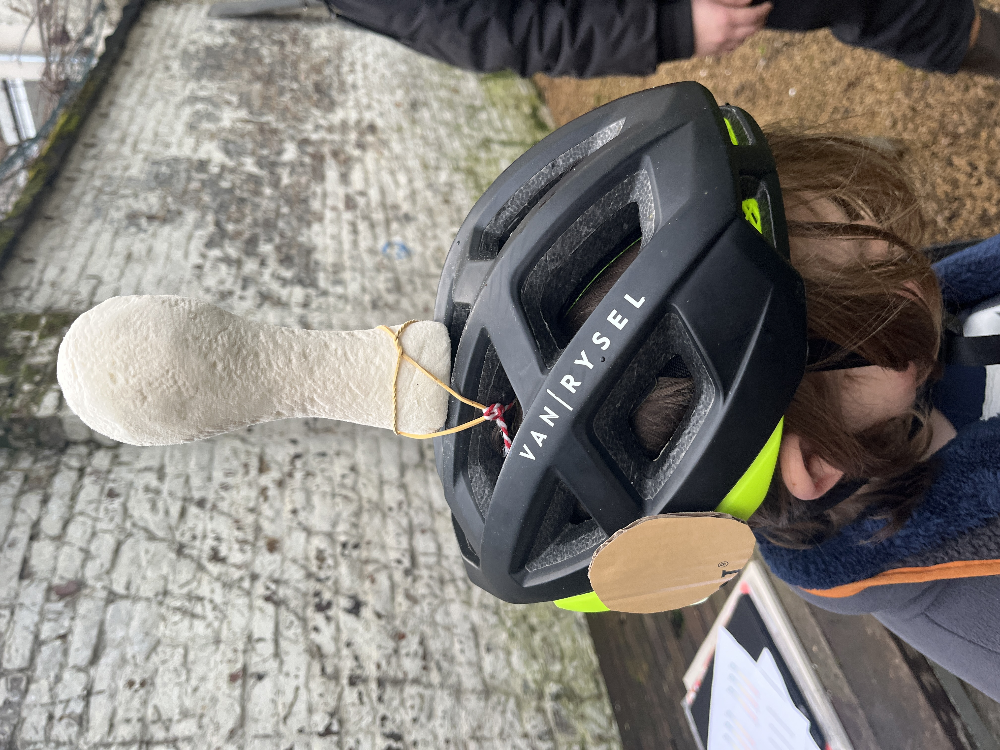
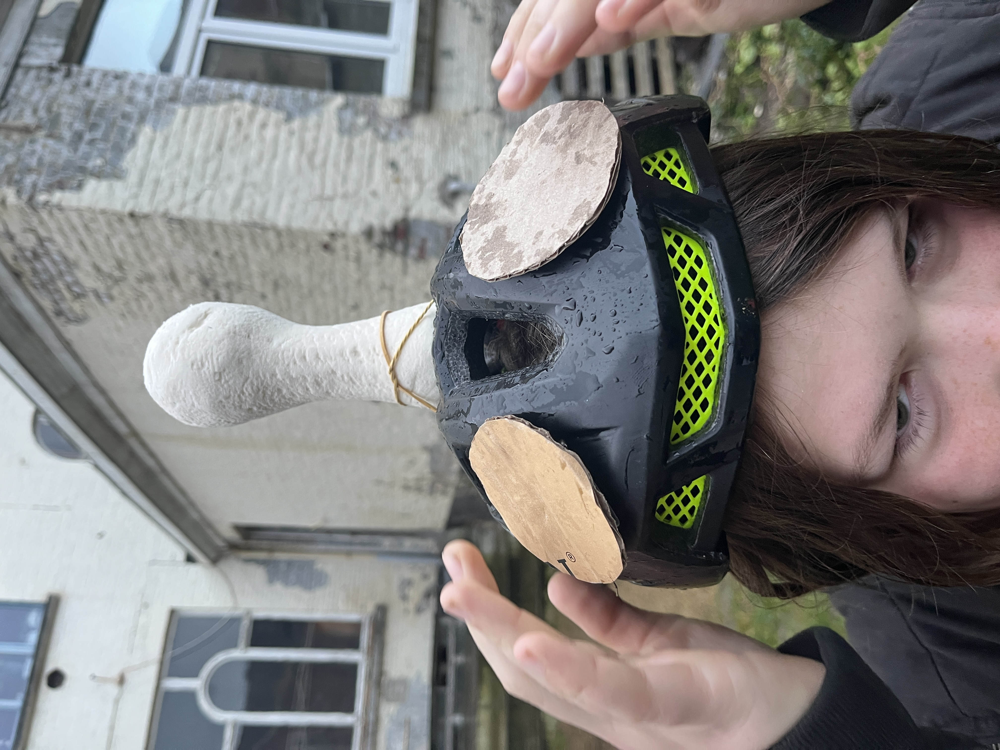

# deelopdracht 3: develop 1

*Kampkode: Robbe de Guytenaer; Kai Cherchye*

## Onderzoeksvragen

- Welke afmetingen moet de helm hebben zodat deze goed op het hoofd van een kind van 6 tot 12 jaar past?
- Is het hand naar het hoofd brengen voor kinderen van 6 tot 12 jaar lastig en welke plaats op de helm zou hier geschikt voor zijn?

## Anthropometrische analyse
### Doelstellingen
In dit onderzoek willen we nagaan wat de afmetingen van het hoofd van de kinderen uit onze doelgroep zijn. Specifiek willen we de afmetingen van de volgende maten weten: omtrek, diepte, breedte. Met deze afmetingen kunnen wij aan de slag gaan met het maken van een 1:1 prototype van de helm.
### Materiaal & methoden
Via de Website DINED (DINED, n.d.) en DINBelg (DINBelg 2005 - Antropometrie Tabel, n.d.) is veel anthropometrische data terug te vinden. Bij DINED is data over de drie maten beschikbaar maar is gelimiteerd tot kinderen van 7-8 jaar. Bij DINBelg is enkel data beschikbaar over de diepte en de breedte maar hier hebben we wel de maten voor onze gehele doelgroep van 6 tot 12 jaar.

Voor omtrek, diepte en breedte bepalen we de toepasselijke ontwerpstrategie: design for the tall. Zoals de meeste fietshelmen tegenwoordig kan je de omtrek aanpassen met een verstelsysteem. We zullen dus de binnenkant van de helm voor de grootste ontwerpen en een verstelsysteem toevoegen zodat ook de kleinsten ze kunnen dragen.

### Data
Een samenvatting van de ruwe data is hieronder te vinden.

- DINBelg

- DINED

### Resultaten
Omdat DINED enkel over data beschikt tot 7-8 jarigen, en we bij DINBelg alle data hebben die nodig is over de hoofd diepte en breedte, besluiten we voor deze twee maten enkel data uit DINBelg te gebruiken. Omdat we 'design for the tall' toepassen kijken we naar de data voor de 12-jarigen. We beslissen om voor P95 te ontwerpen waarbij z95 = 1,645. 
- hoofd diepte

µ = 184 mm

σ = 8,4 mm

P95 = 184 + 1,645*8,4 = 198 mm

- hoofd breedte

µ = 145 mm

σ = 5,5 mm

P95 = 145 + 1,645*5,5 = 154 mm

- hoofd omtrek

Voor de hoofd omtrek hebben we enkel data voor 6-7-8 jarigen, afkomstig van DINED. Deze is dus niet volledig correct. Echter, wanneer we de data van DINBelg bekijken over diepte en breedte zien we dat er een verband is tussen de data op 6-jarige en 12-jarige leeftijd. Bij zowel de diepte als de breedte is de verhouding van het gemiddelde op 12- en 6-jarige leeftijd gelijk aan 1,05. Aangezien de diepte en breedte op 12 jaar met een factor 1,05 verschaald zijn tegenover 6 jaar, zal ook de omtrek met factor 1,05 verschalen (lineair verband). Voor de standaardafwijking behouden we deze uit de DINED tabel, aangezien deze bij DINBelg op 6- en 12-jarige leeftijd bij hoofd diepte en breedte ook ongeveer herzelfde zijn.

µ = 514*1,05 = 540 mm

σ = 13 mm

P95 = 540 + 1,645*13 = 561 mm

### Conclusies & implicaties
Dit onderzoek heeft geleid naar drie belangrijke afmetingen die voor de helm kunnen worden gebruikt. Door 'design for the tall' toe te passen hebben we nu de uiterste grensmaten van de binnenkant van de helm. Hierdoor kunnen 12-jarigen met een groter hoofd ons spel nog spelen. Door gebruik te maken van een verstelsysteem zal de helm ook goed zitten om jongere kinderen met kleinere hoofden.

> [!IMPORTANT]
> design requirement: id = dr005
> 
> **- diepte: 198 mm**
> 
> **- breedte: 154 mm**
> 
> **- omtrek: 561 mm**
> 

## Gebruikerstest (n = 4)

### Doelstellingen
Met deze test willen we checken of kinderen goed met hun arm aan hun eigen hoofd kunnen (voor het bedienen van knoppen op de helm), en of ze daar enige last bij ervaren. Daarnaast willen we ook nagaan wat de geschikte plaats voor deze knoppen is.

### Materiaal & methoden
Op voorhand checkten we via het CAD programma Siemens NX al of de handeling waarbij de hand naar het hoofd wordt gebracht geen moeizame handeling is. Uit onderstaande afbeelding blijkt dat dit niet zo is. Wanneer de handeling wordt vergeleken met normaal rechtop staan zou deze zelf comfortabeler moeten zijn, volgens NX.

Voor de eigenlijke test gebruiken we een fietshelm met daar op twee kartonnen schijfjes die dienen als 'knoppen'. De knoppen kunnen we gemakkelijk van plaats veranderen. We voorzien drie verschillende posities van de knoppen op de helm, die u in de bijlage kan bekijken voor meer uitleg. 

- Positie (1): 30°
- Positie (2): 50°
- Positie (3): 90°

  
  
  

De evaluatie gebeurt door middel van een formulier die elke testpersoon na elke test invult. Per positie krijgen ze telkens twee vragen: 
1. Hoe moeiteloos voer je de handeling uit (dus geen fysieke klachten)?
2. Hoe gemakkelijk was het om tot aan de knoppen te geraken met je hand?

De testpersonen moeten deze vragen beantwoorden met een getal van 1 tot en met 10. De vragen zijn zo opgesteld dat een hoge score altijd beter is. Uiteindelijk wordt de som genomen van de verschillende scores en vergeleken welke de hoogste is. Voor het volledige testprotocol [klik hier](https://docs.google.com/document/d/1qsDwQ6EiPjP-JWYGr8CEKEJXH-XV2juMJEdnvjv8eBw/edit?usp=sharing).

  
  
  
  

### Resultaten
De analyse van de test vind u [hier](https://docs.google.com/document/d/1ZRpwBia3VsVxvKJdy04LyPjPbcNBf2uAUljXbXaIf1M/edit?usp=sharing).

Hieronder de resultaten in een tabel, waaruit blijkt dat Positie (2) de hoogste score haalt en dus de beste positie is, volgens de vier testpersonen.

||Positie (1)|Positie (2)|Positie (3)|
|---:|:---:|:---:|:---:|
|TOTAAL|69|73|65|
|relatief|0,863|0,913|0,813|

### Conclusies & implicaties
De comfortabelste houding (van de drie geteste houdingen) voor de hand naar het hoofd te brengen is rondom de 50°. Ook wordt er zo goed als geen moeite ervaren bij het uitvoeren van de handeling.

> [!IMPORTANT]
> design requirement: id = dr006
> 
> **Beide knoppen op de helm moeten symmetrisch op een hoek van 50° gepositioneerd zijn ten opzichte van de vooruitkijkrichting.**

## Bronnen
DINED. (n.d.). https://dined.io.tudelft.nl/en/database/tool

DINBelg 2005 - antropometrie tabel. (n.d.). https://www.dinbelg.be/index.htm
